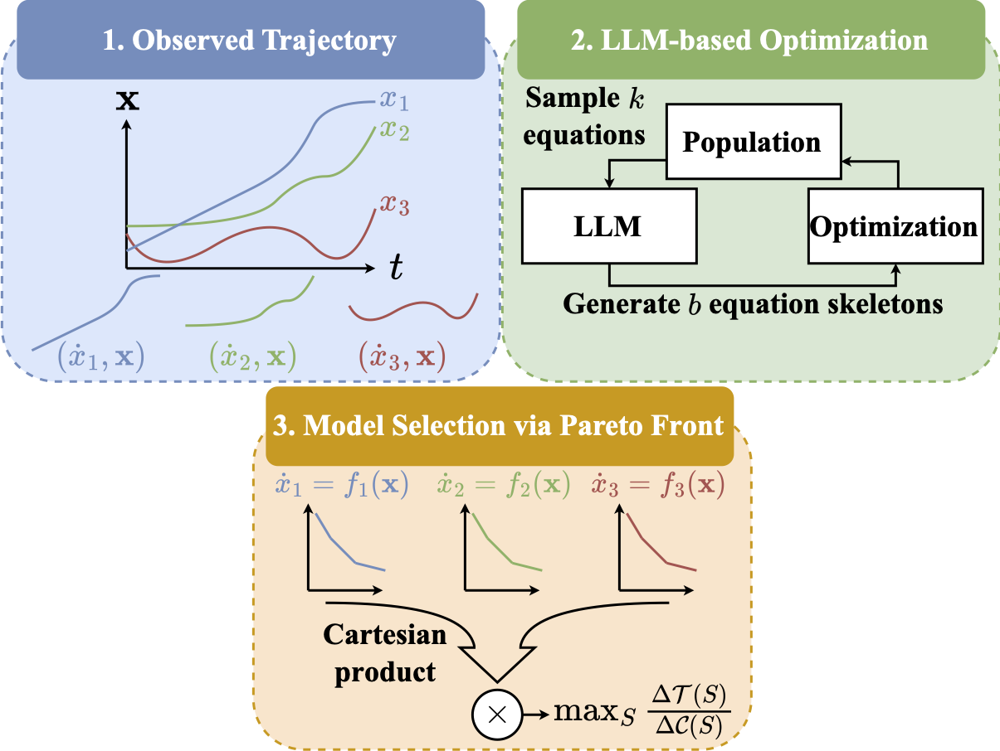

# LLM-ODE
<div align="center">

[](https://www.python.org/)
[](LICENSE)
[](TBA)

</div>

**Official implementation of paper [LLM-ODE: Data-driven Discovery of Dynamical Systems with Large Language Models](TBA) (GECCO 2026)**

## Overview

Genetic programming (GP) is a established approach for automated equation discovery but suffers from inefficient search and slow convergence. LLM-ODE addresses this by using an LLM as a genetic variation operator that extracts patterns from elite candidate equations to guide symbolic evolution more effectively. Evaluated on 91 dynamical systems, LLM-ODE consistently outperforms standard GP baselines in search efficiency and solution quality, with stronger scalability to high-dimensional systems than linear or Transformer-only methods.



## Installation

First, you need to install the dependencies.

```
git clone git@github.com:gryaklab/llm-ode.git
cd llmode
uv sync
```

## Training and evaluation

The script `serve_and_run.sh` launches the vllm servers in the background and runs the LLM-ODE on all the datasets:

```
chmod +x serve_and_run.sh
./serve_and_run.sh
```

## Baseline methodss

In separate environemnts, you need install the required packages for each baseline method. Then, issue:

```
python -m baselines.pysr --save_dir results/pysr/
python -m baselines.sindy --save_dir results/sindy/
python -m baselines.odeformer --save_dir results/odeformer/
```

## Test

Issue `uv run pytest`.

## Citation

If you find our work useful, consider a ⭐️ and citing us with

```bibtex
TBA
```

## License

This project is licensed under the MIT License. See the [LICENSE](LICENSE) file for details.
